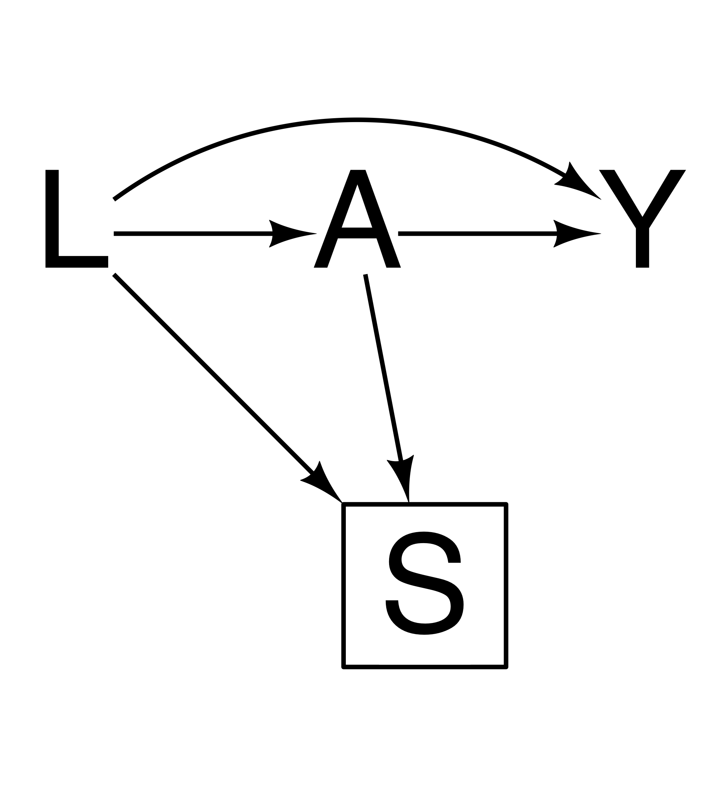

<!-- README.md is generated from README.Rmd. Please edit that file -->

# ggdiagram-dag

``` r
library(ggdiagram)

ggdiagram() +
  {
    L <- ob_rectangle(
      label = ob_label("L", size = 96),
      linewidth = 0
    )
  } +
  {
    A <- ob_rectangle(
      label = ob_label("A", size = 96),
      linewidth = 0
    ) |>
      place(from = L, where = "right", sep = 2.5)
  } +
  {
    Y <- ob_rectangle(
      label = ob_label("Y", size = 96),
      linewidth = 0
    ) |>
      place(from = A, where = "right", sep = 2.5)
  } +
  {
    S <- ob_rectangle(
      label = ob_label("S", size = 96, nudge_y = -.15),
      width = 2,
      height = 2,
      linewidth = 1.5
    ) |>
      place(from = L, where = "southeast", sep = 4)
  } +
  connect(from = L, to = A, linewidth = 1.5) +
  connect(from = L, to = S, linewidth = 1.5) +
  connect(from = A, to = S, linewidth = 1.5) +
  connect(from = A, to = Y, linewidth = 1.5) +
  connect(from = L, to = Y, linewidth = 1.5, arc_bend = -.4)
```


